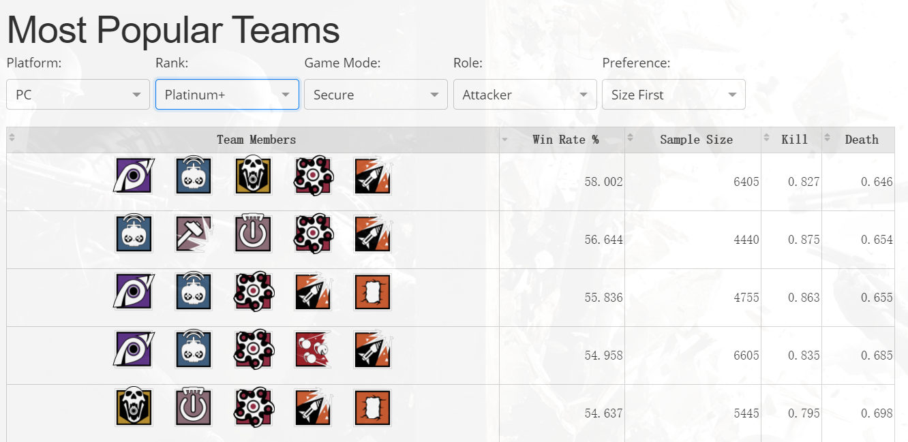
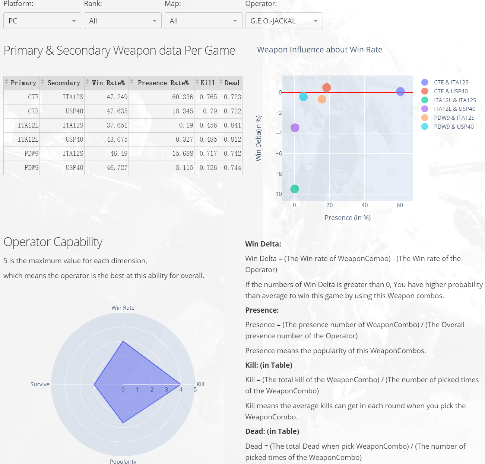
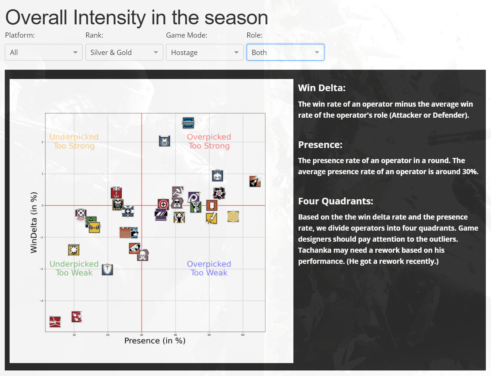
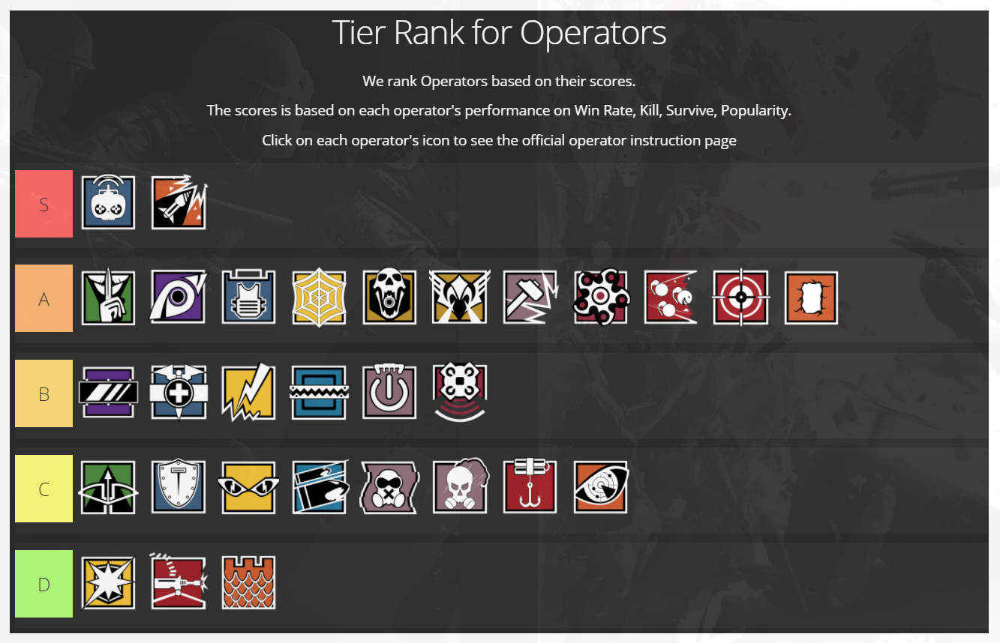

## Why do we choose this dataset?

This dataset is an official Rainbow Six Siege data peek from Ubisoft. This dataset contains 31 attributes from more than 20 million ranked games. With this 19 GB dataset, we can find many interesting facts about this game. 

## What's the challenge?

This is my first time work on such a big dataset. I think it would be a good chance for me to learn Python and its libraries and use them to do some data analysis. Besides that, building a website without using HTML/JS/CSS is something that I've never tried before. Therefore, I decided to start this project and see how far I can go with these new tools.

## What's cool about this project?

### Interesting facts about R6

We want to make a website that provides interesting topics for the players of Rainbow 6 Siege. For example, there is a laser sight attachment option for most primary and secondary weapons. It tightens a weapon's hip-fire accuracy and a shotgun pellet's spread; on the other hand, laser sight might expose the user to the enemy. Whether using laser sights has been a controversial question for a long time. However, we can use my website to find the relationship between using laser sights and the win rate to find out whether a laser sight is good or not.

### Cusomizable searches for all levels of players

Players can easily find useful information for their rank levels and platforms. The dropdown menus allow the players to narrow down the search to find the most accurate subset of data from the large 19GB dataset.

### Easy to read charts and graphs

For players who don't like read the numbers, we also provide the rankings for operators based on their presence rate and performance.

## What's my role in this project?

- Choose the framework, dataset, and the topics for this project
- UI design
- Functionality design and implement interactive features
- Raw data analysis and cleaning (20G raw CSV file) with panda

Github Repo Source : <a href="https://github.com/ICS-484-Rainbow6/Rainbow6"><i class="large github icon "></i>Rainbow 6 Siege Data Analysis</a>
