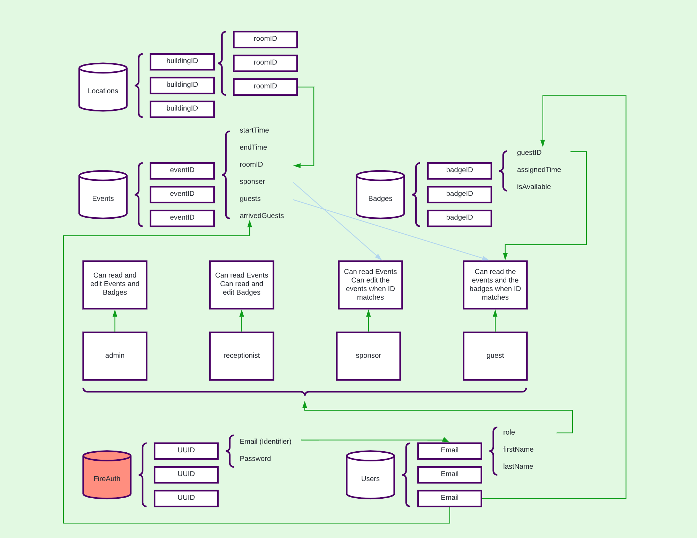
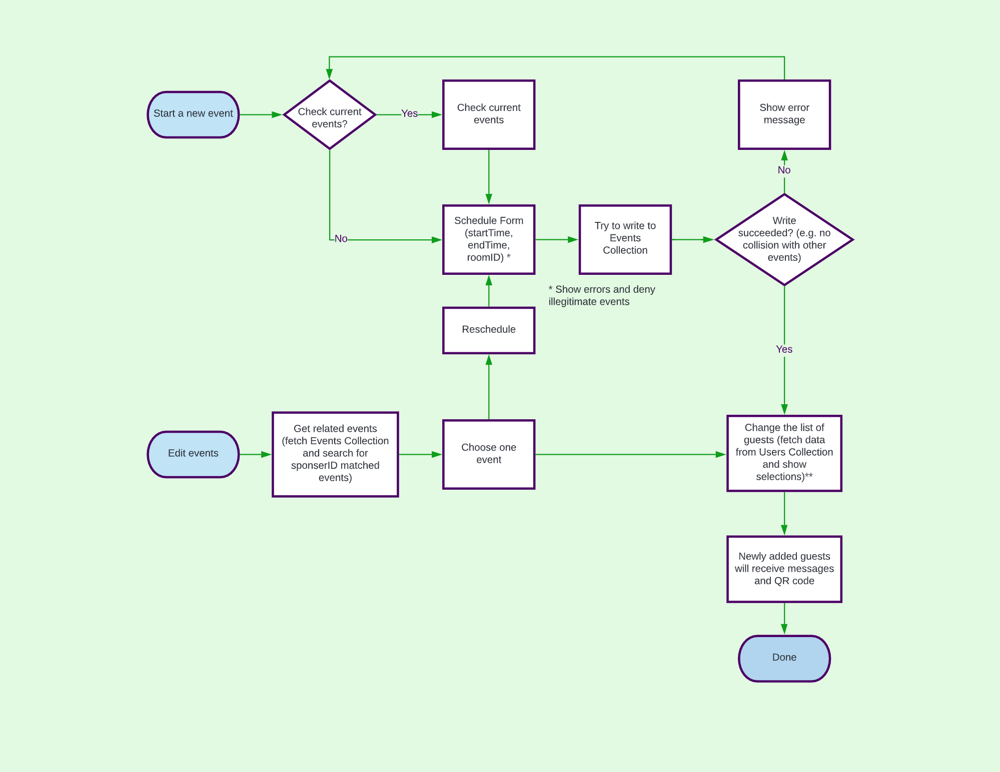
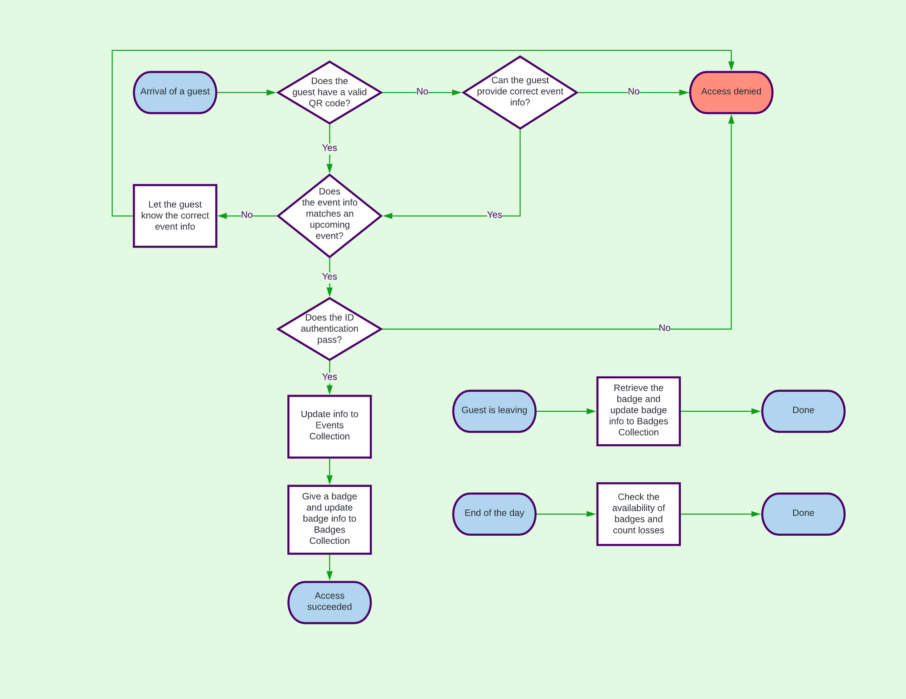

## What is HACC?

<a href="https://hacc.hawaii.gov/">Hawaii Annual Code Challenge (HACC)</a> is a unique hackathon that lasts for a few weeks to encourage the developers and the event sponsors to communicate and provide sustainable solutions for the state of Hawaii.

In this year, I joined the HACC 2020 with my friends <a href="https://tianhuizhou.github.io/">Tianhui Zhou</a> and <a href="https://heweiron.github.io/">Weirong He</a>. We formed Team Trigeeks, worked together on the UH building security topic and won the third prize.

## What is UHShield?

### About the challenge

Some UH buildings require significant access control, such as the IT Center.  The ITC has an Emergency Situation Room and a Data Center. Currently, building security requires physical monitoring of guests, which is resource intensive and not always feasible. The goal of this challenge is to explore application designs that improve security for UH buildings while reducing personnel costs.

### Our solution

For Sponsor:

- Sponsors can use our APP to create new event and then send invitation email with QR-Code to their guests.

- UHShield will automaticly check place or time conflict before creating event.

- Sponsors can also easily manage their own events: edit or delete.

- When guests showed up, sponsor can use our APP to take attendance of checked-in guests.

- Sponsors can browse all the events in the campus and use search function to quick look up for a certain event.

For Reception:

- Receptionists are assigned to a certain building which is their workplace.

- They just need to scan the QR-Code provided by guest to make check in.

- If guest don’t have QR-Code, receptionists can also use event list of the day or search function to make check in.

- After successfully checked in, receptionists should assigned a physical badge to each guest and using our APP to record badge.

- Receptionists also need to recycle badges from guest and delete badge information as check out.

## How do we work together?

### 1. Understand the requirement

Before the HACC kick-off day, everyone in our team carefully read the requirement documentations to find our some topics that we may work on. After that, each of us went to a event breakout room to talk with the event sponsor. When I was listening to the event sponsor of UH security, Mr. Michael Hodges, I was drawing the blueprint in my mind. I asked him more details about the requirement, such as the relationship between the badges and the visitors. When the one hour event description section was over, the blueprint was done and I knew exactly what to do next.

### 2. Data structure and workflow design

On the next day, I decided to draw those flowcharts for my team instead of having a huge QA session. I was not very sure how to draw those flowcharts, but I believed that the flowcharts could help reduce uncertainty.

### 3. Communication!

The major difference between this team Trigeeks and other teams was communication. I actively talked with my teammates about all the details and technicle issues. We always knew which part other members were working on, and which part needed to be done next.

## What did I learn?

### Teamwork is the key

### Great Experience
